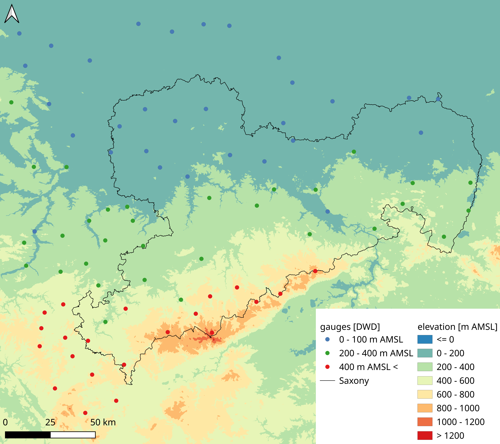
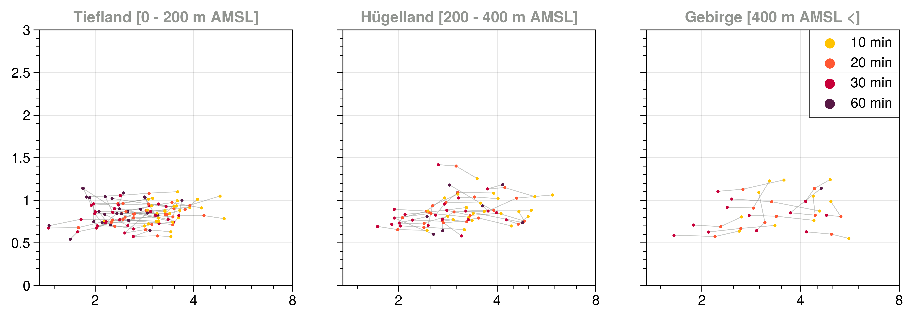

    

This python script analyzes orographic effects on extreme precipitation events and statistics for the Ore Mountains.    

## Data sources
1) 10 min-dissolved historical precipitation [data](https://opendata.dwd.de/climate_environment/CDC/observations_germany/climate/10_minutes/precipitation/historical/) from DWD's open data server   
3) daily objective synoptic classification [data](https://www.dwd.de/DE/leistungen/wetterlagenklassifikation/online_wlkvorhersage.txt;jsessionid=1F0BCB25E9FF37EDF051BC5A8C1F48E5.live11053?view=nasPublication&nn=16102) from DWD    

## Python packages and dependencies 
cycler          0.11.0
DateTime        4.4
fonttools       4.33.3
kiwisolver      1.4.2
matplotlib      3.5.2
numpy           1.22.3
packaging       21.3
pandas          1.4.2
Pillow          9.1.1
pip             22.1
proplot         0.9.5
pyparsing       3.0.9
python-dateutil 2.8.2
pytz            2022.1
scipy           1.8.1
setuptools      58.1.0
six             1.16.0
typing          3.7.4.3
zope.interface  5.4.0

## Results

