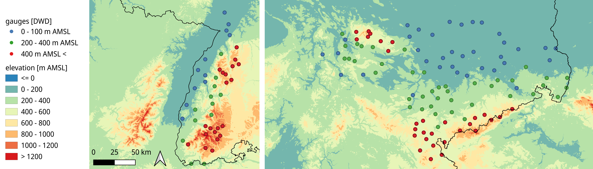
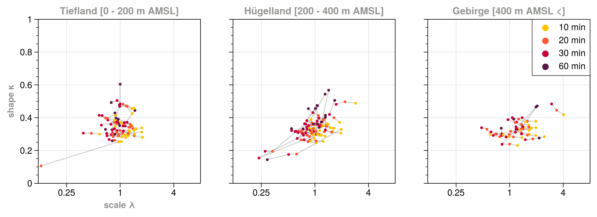
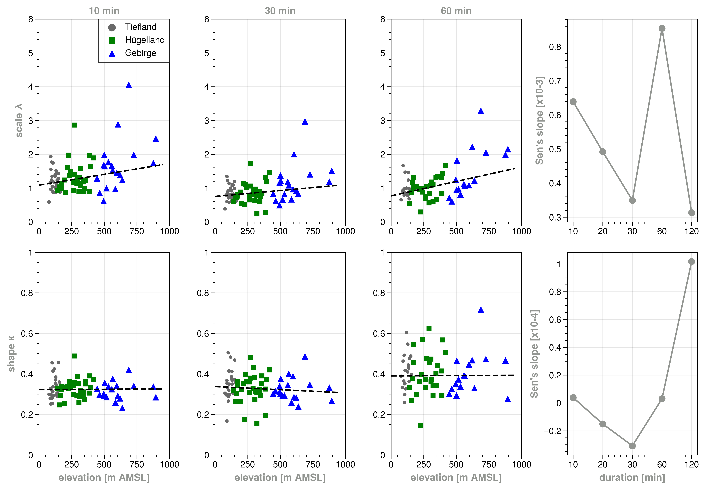
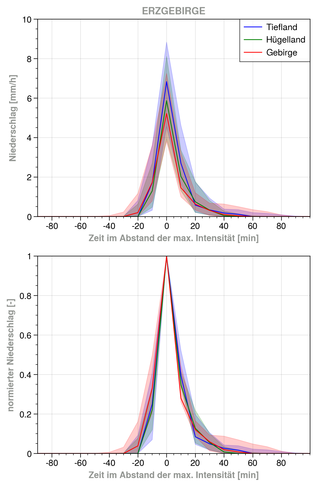
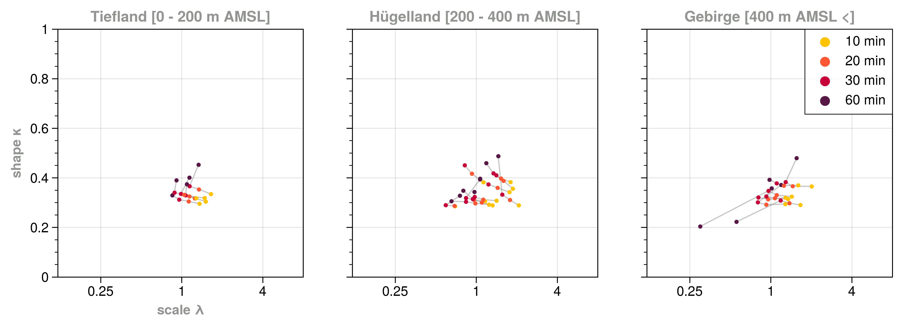
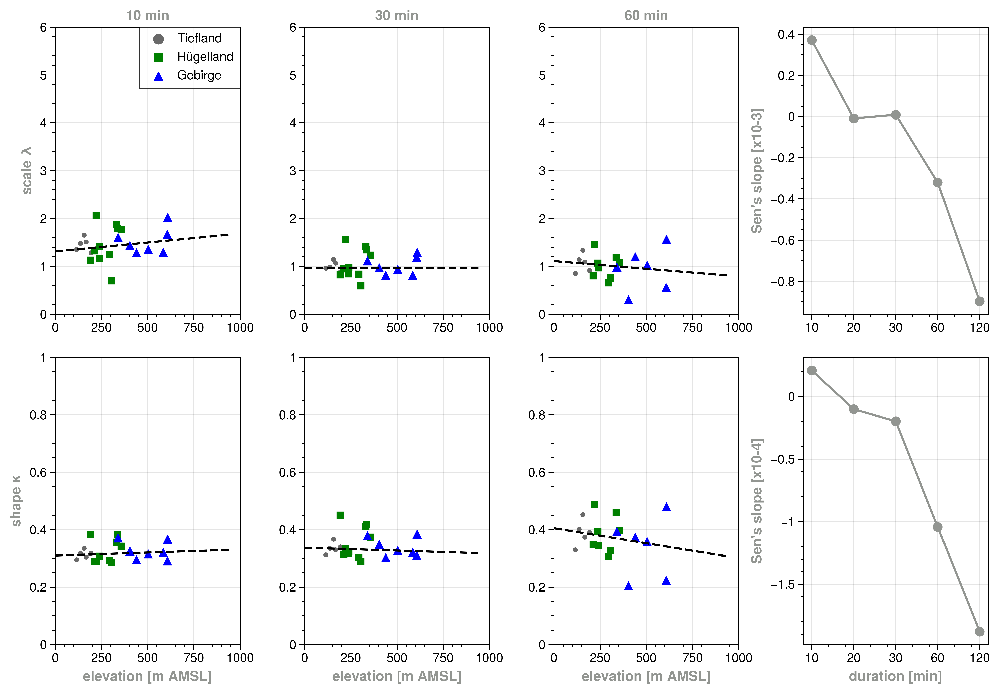
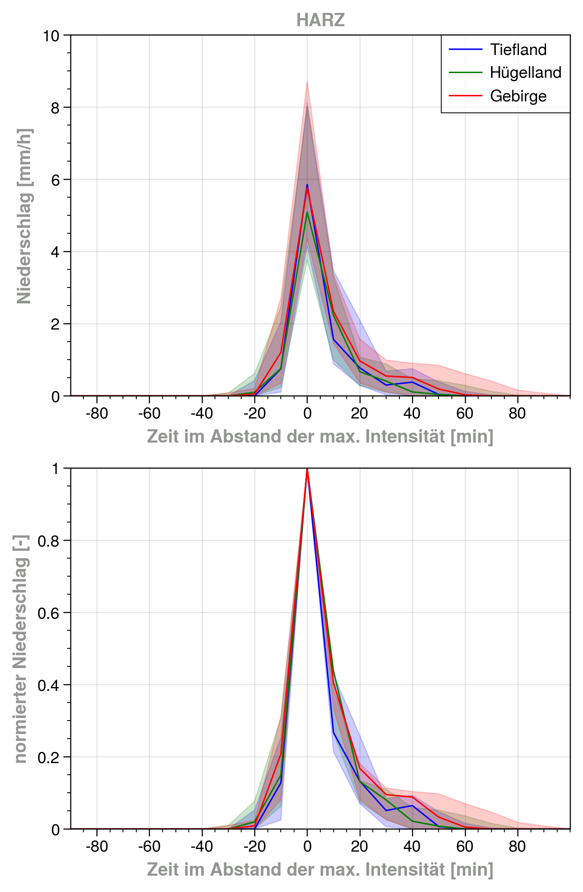
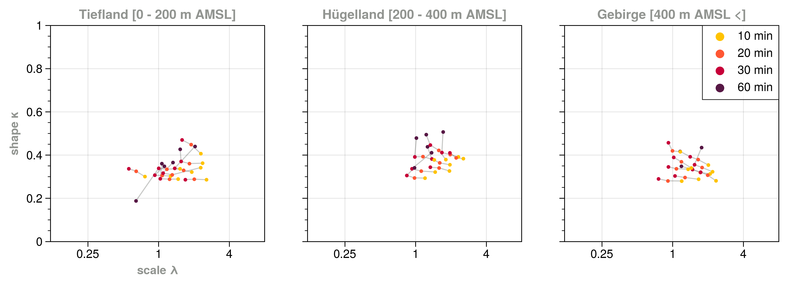
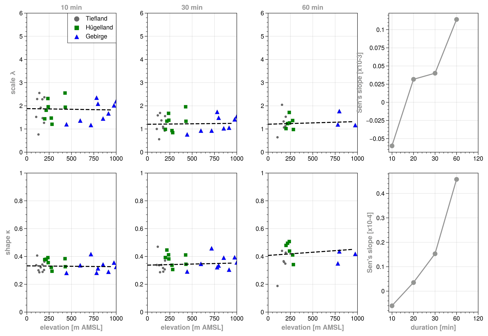
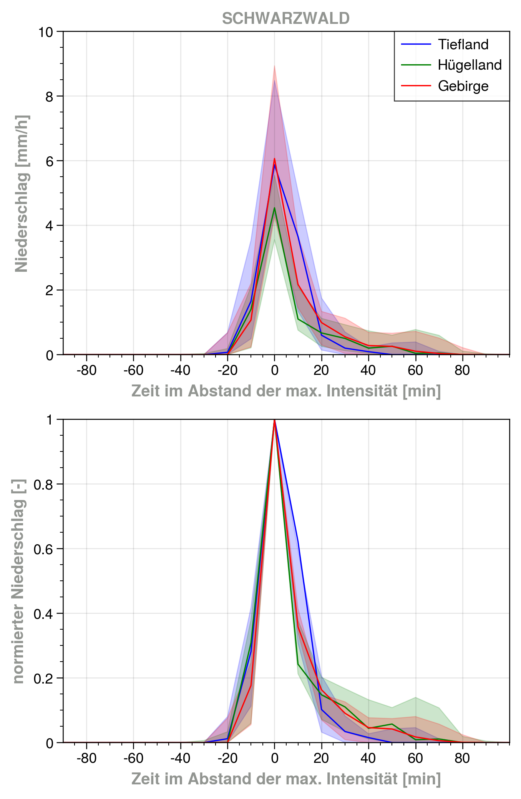

[](https://)
[](https://)
[](https://)

This python script analyzes orographic effects on extreme precipitation events for 3 different low mountain ranges in Germany.

Made as part of the lecture "Fachvorträge Hydrologie" at TU Dresden.

## Overview
#### Study Regions: Black Forest, Harz mountains, Ore mountains
    

## Data sources
1. [10 min historical precipitation data](https://opendata.dwd.de/climate_environment/CDC/observations_germany/climate/10_minutes/precipitation/historical/) (DWD)
2. [daily objective synoptic classification](https://www.dwd.de/DE/leistungen/wetterlagenklassifikation/online_wlkvorhersage.txt;jsessionid=1F0BCB25E9FF37EDF051BC5A8C1F48E5.live11053?view=nasPublication&nn=16102) (DWD)
3. [European Digital Elevation Model (EU-DEM), version 1.1](https://land.copernicus.eu/imagery-in-situ/eu-dem/eu-dem-v1.1?tab=download) (Copernicus)
## Python packages and dependencies 
cycler          0.11.0
DateTime        4.4
fonttools       4.33.3
kiwisolver      1.4.2
matplotlib      3.5.2
numpy           1.22.3
packaging       21.3
pandas          1.4.2
Pillow          9.1.1
pip             22.1
proplot         0.9.5
pyparsing       3.0.9
python-dateutil 2.8.2
pytz            2022.1
scipy           1.8.1
setuptools      58.1.0
six             1.16.0
typing          3.7.4.3
zope.interface  5.4.0

## Usage example
arguments are explained within run_main.sh    
```shell
#!/bin/bash
set -e

python code/main.py ERZGEBIRGE 36 75 3 10 5 &
python code/main.py HARZ 30 50 3 10 5 &
python code/main.py SCHWARZWALD 24 75 3 10 5
```
## Methods
The methodical steps are primarily inherited and adapted from [Marra et al. 2020](https://agupubs.onlinelibrary.wiley.com/doi/abs/10.1029/2020GL091498).   
1. extract independent storms from time series
2. extract ordinary events from independent storms
3. fit Weibull distribution to 75% percentile

## Results
#### Ore mountains
   
    
    

#### Harz mountains
   
    
    

#### Black forest
   
    
    